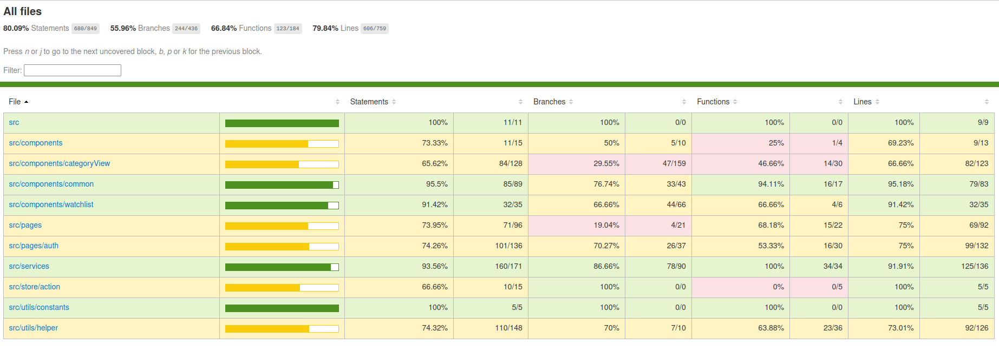

# My Film Project

---

## 1. **Project Overview**

### Goal
The objective was to create a movie and TV series search and bookmarking application using the OMDb API. This application allows users to search for movies/TV series, bookmark them as favorites, and organize them into watchlists.

### Technical Overview
My Film is a React application built with TypeScript. It includes state management using Redux and integrates Firebase for backend services. This project utilizes various libraries and tools to enhance the development and testing experience.
---

## 2. **Functional Requirements**

### 2.1 **User Authentication**
- **Login Page**
  - Redirects unauthenticated users to the login page.
  - Supports login via email/password and Google.
  - Redirects authenticated users to the Home page.
  - Includes a registration option for new users.

- **Signup**
  - Displays a modal with fields for full name, email, password, and confirm password.
  - Enforces validation: full name (max 50 chars), email format, and password matching.
  - Contains 'Sign up' and 'Cancel' buttons.

### 2.2 **Offline Mode**
- Redirects users to an 'offline page' if network connectivity is lost during HTTP requests.

### 2.3 **Navigation Bar**
- Contains links to Home, Favorites, and Watchlists.
- Displays user profile information with the option to log out.
- Excluded from the login page.

### 2.4 **Home Page**
- Features a search section for movies/TV series by name.
- Displays a list of favorites and watchlists, showing messages if none are available.
- Includes a 'Trending Watchlists' section for public watchlists created by other users.

### 2.5 **Search Page**
- Activated upon search submission from the Home page.
- Offers advanced search options via a dropdown (All, Movies, TV series).
- Displays results in a thumbnail view with pagination (List view not implemented).

### 2.6 **Favorites**
- Accessible from the navigation bar and Home page.
- Displays items in both thumbnail and list views.
- Allows removal of favorites.

### 2.7 **My Watchlists**
- Similar access and layout to the Favorites section.
- Watchlists are displayed with thumbnails showing movie counts and poster collages.
- Supports creation, deletion, and modification of watchlists, including privacy settings.
- Displays watchlist details, allowing users to remove items.

### 2.8 **Trending Watchlist**
- Similar in layout to 'My Watchlists' but without creation/deletion options.
- Displays watchlist details, allowing users to view but not modify contents.

### 2.9 **Movie/Series Details Modal**
- Opens on clicking a movie/series thumbnail, displaying detailed information.
- Allows adding/removing from favorites and watchlists.

---

## 3. **Design and Assets**
- The design was conceptualized using Figma.
- Project assets were compiled in a provided zip file.

---

## 4. **Technical Requirements and Implementation**

### 4.1 **Technology Stack**
- **Frontend:** React (CRA TypeScript template)
- **State Management:** Redux
- **Authentication and Database:** Firebase Firestore
- **Frontend Local Database:** Index DB
- **Styling:** CSS (initially intended to use Sass)
- **Testing:** Aiming for at least 70% unit test coverage
- **Version Control:** GitHub
- **Deployment:** Deployed on platforms like Firebase, Vercel, or Netlify

### 4.2 **Unit Testing**
- Achieved a unit test coverage of at least 79.84%, ensuring robust and reliable code.
  

### 4.3 **Deployment**
- The application was deployed online, making it accessible to users.
- live version can be accessed through : 
---

## 5. **Additional Notes**
- **List View Limitation:** Due to API limitations, the list view for search results was not implemented as planned.
- **Styling:** CSS was used for styling.


## Installation

1. **Clone the repository**:
   ```
   git clone https://github.com/shivrajansingh/my-films.git
   cd my-film
   ```

2. **Install dependencies**:
   ```
   npm install --force
   ```

## Scripts

- **Start Development Server**:
  ```
  npm start
  ```
  Runs the app in development mode. Open [http://localhost:3000](http://localhost:3000) to view it in the browser.

- **Build for Production**:
  ```
  npm run build
  ```
  Builds the app for production to the `build` folder.

- **Run Tests with Coverage**:
  ```
  npm run test:coverage
  ```
  Runs tests and generates a coverage report, with current unit testing coverage at **79.84%**.

  

## Dependencies

The project relies on a range of libraries, including but not limited to:

- **React & React DOM**: Core libraries for building user interfaces.
- **TypeScript**: Superset of JavaScript providing static typing.
- **Redux Toolkit**: For efficient Redux state management.
- **React Router DOM**: Enables routing within the app.
- **Firebase**: Used for backend services.
- **Local Database**: Index DB Used for frontend database services
- **Testing Libraries**: Jest, React Testing Library, and others for testing components and ensuring code quality.

## Development Dependencies

- **Jest**: JavaScript testing framework.
- **ts-jest**: TypeScript preprocessor for Jest.
- **Testing Utilities**: Includes mocks for IndexedDB, fetch, and Firebase for testing purposes.

## Browsers Support

- **Production**: Supports the latest versions of major browsers.
- **Development**: Optimized for the last versions of Chrome, Firefox, and Safari.

## Documentation

Detailed code documentation and guides are available in the `/docs` directory. Please refer to these resources for more in-depth explanations of the project's architecture, components, and state management.
